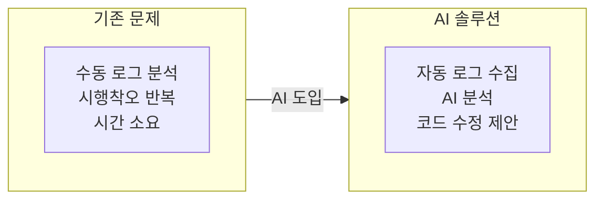
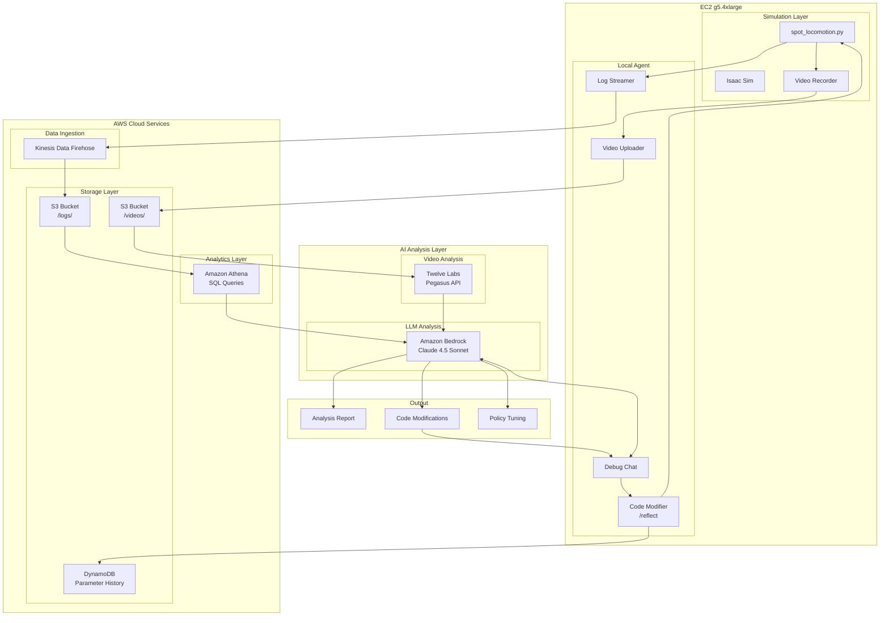
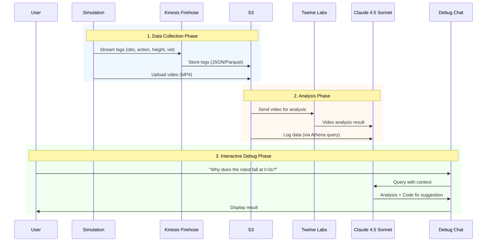

# Spot Robot RL Training & AI-Powered Debug System

AWS EC2에서 NVIDIA Isaac Sim/Lab을 활용한 Boston Dynamics Spot 로봇 강화학습 훈련 및 **AI 기반 자동 디버깅 시스템**

## Project Goal

이 프로젝트의 목표는 강화학습 정책 디버깅 과정을 AI로 자동화하는 것입니다:

1. **문제**: RL 정책이 standalone 환경에서 실행될 때 로봇이 넘어지는 문제 발생
2. **기존 방식**: 수동으로 로그를 분석하고, 파라미터를 조정하고, 코드를 수정하는 반복 작업
3. **새로운 방식**: AI가 로그와 비디오를 분석하여 문제 원인을 파악하고 수정 사항을 자동으로 제안



## 목차

1. [EC2 인스턴스 및 Isaac Sim 설치](#1-ec2-인스턴스-및-isaac-sim-설치)
2. [Isaac Lab으로 강화학습 훈련](#2-isaac-lab으로-강화학습-훈련)
3. [spot_locomotion.py로 로봇 제어](#3-spot_locomotionpy로-로봇-제어)
4. [AI 디버그 시스템](#4-ai-디버그-시스템)

---

## System Architecture



## Data Flow



---

## 1. EC2 인스턴스 및 Isaac Sim 설치

### 1.1 EC2 인스턴스 생성

| 항목 | 권장 사양 |
|------|---------|
| Instance Type | g5.4xlarge (NVIDIA A10G GPU) |
| OS | Ubuntu 22.04 LTS |
| Storage | 200GB+ SSD |
| Security Group | SSH(22), DCV(8443) |
| IAM Role | spot-robot-debug-ec2-profile |

### 1.2 설치 순서

```bash
# 1. EC2 접속
ssh -i your-key.pem ubuntu@<EC2-PUBLIC-IP>

# 2. 설치 스크립트 업로드
scp -i your-key.pem setup/*.sh ubuntu@<EC2-IP>:~/

# 3. 스크립트 실행
chmod +x *.sh
./01_ec2_setup.sh
./02_nvidia_driver.sh
sudo reboot

# 재부팅 후
./03_isaac_sim_install.sh
./04_nicedcv_setup.sh
```

### 1.3 IsaacLab 설치

```bash
cd ~/isaac-sim
git clone https://github.com/isaac-sim/IsaacLab.git
cd IsaacLab
ln -s ~/isaac-sim/IsaacSim/_build/linux-x86_64/release _isaac_sim
./isaaclab.sh --install
```

---

## 2. Isaac Lab으로 강화학습 훈련

### 2.1 훈련 시작

```bash
cd ~/isaac-sim/IsaacLab

./isaaclab.sh -p scripts/reinforcement_learning/rsl_rl/train.py \
  --task Isaac-Velocity-Flat-Spot-v0 \
  --num_envs 4096 \
  --headless \
  --max_iterations 1500
```

### 2.2 훈련 옵션

| 옵션 | 설명 | 권장값 |
|------|------|--------|
| `--task` | 훈련 태스크 | Isaac-Velocity-Flat-Spot-v0 |
| `--num_envs` | 병렬 환경 수 | 4096 |
| `--headless` | GUI 없이 실행 | 필수 |
| `--max_iterations` | 훈련 반복 횟수 | 1500~3000 |

### 2.3 훈련 결과

```
~/isaac-sim/IsaacLab/logs/rsl_rl/spot_flat/
└── 2026-01-15_02-09-06/
    ├── model_1500.pt          # 학습된 정책
    ├── params/env.yaml        # 환경 설정
    └── params/agent.yaml      # 에이전트 설정
```

### 2.4 play.py vs spot_locomotion.py

| 기능 | play.py | spot_locomotion.py |
|------|---------|----------------------|
| 정책 실행 | O | O |
| 키보드 제어 (WASD) | **X** | **O** |
| 3인칭 카메라 추적 | X | **O** |
| 동시 키 입력 (W+A 등) | X | **O** |
| IsaacLab 네이티브 실행 | O | O |

**play.py는 키보드 컨트롤을 지원하지 않습니다.** 키보드로 직접 제어하면서 학습된 정책의 보행을 확인하려면 `spot_locomotion.py`를 사용하세요.

---

## 3. spot_locomotion.py로 로봇 제어

이 스크립트는 학습된 RL 정책을 로드하여 Spot 로봇을 키보드로 실시간 제어하는 인터랙티브 데모입니다. IsaacLab 환경 위에서 직접 실행되므로 별도의 standalone 래퍼가 필요 없습니다.

### 3.1 소스코드 구조 및 주요 함수 설명

`spot_locomotion.py`는 크게 **초기화 → 시뮬레이션 루프** 두 단계로 동작합니다.

#### Step 1: 인자 파싱 및 시뮬레이터 실행 (Line 31~53)

```python
parser = argparse.ArgumentParser(...)
cli_args.add_rsl_rl_args(parser)
AppLauncher.add_app_launcher_args(parser)
args_cli = parser.parse_args()

app_launcher = AppLauncher(args_cli)
simulation_app = app_launcher.app
```

**왜 하는가**: `AppLauncher`는 Isaac Sim의 Omniverse 런타임을 부팅합니다. 이 단계가 완료되어야 GPU 물리 시뮬레이션, 렌더링, USD 스테이지가 활성화됩니다. RSL-RL 관련 CLI 인자(`--checkpoint`, `--load_run` 등)도 여기서 파싱되어 이후 체크포인트 로딩에 사용됩니다.

#### Step 2: `SpotLocomotionDemo.__init__()` — 환경 및 정책 로드 (Line 93~130)

```python
# 체크포인트 경로 결정
checkpoint = get_checkpoint_path(log_root_path, ...)

# 환경 생성: 모든 velocity command를 0으로 초기화 (로봇이 가만히 서 있음)
env_cfg = SpotFlatEnvCfg_PLAY()
env_cfg.commands.base_velocity.ranges.lin_vel_x = (0.0, 0.0)

# RSL-RL 래퍼로 감싸기
self.env = RslRlVecEnvWrapper(ManagerBasedRLEnv(cfg=env_cfg))

# 학습된 PPO 정책 로드
ppo_runner = OnPolicyRunner(self.env, agent_cfg.to_dict(), ...)
ppo_runner.load(checkpoint)
self.policy = ppo_runner.get_inference_policy(device=self.device)

# 키보드 명령 버퍼 (num_envs, 3): [lin_vel_x, lin_vel_y, ang_vel_z]
self.commands = torch.zeros(env_cfg.scene.num_envs, 3, device=self.device)
```

**왜 하는가**: `SpotFlatEnvCfg_PLAY`는 평지 보행용 환경 설정입니다. 초기 velocity command를 모두 0으로 설정하는 이유는 시작 시 로봇이 정지 상태를 유지하다가, 사용자가 키보드 입력을 할 때만 움직이게 하기 위함입니다. `commands` 텐서는 이후 매 스텝마다 observation에 주입되어 정책이 어떤 속도로 움직일지 결정하는 기준이 됩니다.

#### Step 3: `create_camera()` — 3인칭 카메라 생성 (Line 132~146)

```python
camera_prim = stage.DefinePrim(self.camera_path, "Camera")
camera_prim.GetAttribute("focalLength").Set(8.5)
self.viewport.set_active_camera(self.camera_path)
```

**왜 하는가**: USD 스테이지에 카메라 프리미티브를 생성하고 뷰포트에 연결합니다. 초점 거리 8.5mm로 설정하여 넓은 시야각을 확보합니다. 이 카메라는 `update_camera()`에서 로봇을 자동 추적하므로, 사용자가 로봇의 보행 상태를 직관적으로 관찰할 수 있습니다.

#### Step 4: `set_up_keyboard()` — 키보드 입력 바인딩 (Line 148~180)

```python
self._key_to_control = {
    "W": torch.tensor([FORWARD_SPEED, 0.0, 0.0], ...),  # 전진
    "S": torch.tensor([-BACKWARD_SPEED, 0.0, 0.0], ...), # 후진
    "A": torch.tensor([0.0, 0.0, TURN_SPEED], ...),      # 좌회전
    "D": torch.tensor([0.0, 0.0, -TURN_SPEED], ...),     # 우회전
    "Q": torch.tensor([0.0, STRAFE_SPEED, 0.0], ...),    # 좌측 이동
    "E": torch.tensor([0.0, -STRAFE_SPEED, 0.0], ...),   # 우측 이동
    "SPACE": torch.tensor([0.0, 0.0, 0.0], ...),         # 정지
}
self._active_keys: set[str] = set()
```

**왜 하는가**: 각 키를 3차원 velocity command 벡터 `[lin_vel_x, lin_vel_y, ang_vel_z]`에 매핑합니다. `_active_keys` set을 사용하여 **동시 키 입력을 지원**합니다 (예: W+A를 누르면 전진하면서 좌회전). 이 방식 덕분에 조이스틱처럼 자연스러운 조합 제어가 가능합니다.

#### Step 5: `_on_keyboard_event()` / `_update_commands()` — 키 입력 처리 (Line 182~221)

```python
def _on_keyboard_event(self, event):
    if event.type == KEY_PRESS:
        if key == "SPACE":
            self._active_keys.clear()  # 모든 입력 해제
            self.commands[:] = 0.0
        elif key in self._key_to_control:
            self._active_keys.add(key)
            self._update_commands()

def _update_commands(self):
    cmd = torch.zeros(3, device=self.device)
    for key in self._active_keys:
        cmd += self._key_to_control[key]
    cmd[0] = cmd[0].clamp(-2.0, 3.0)   # lin_vel_x 범위 제한
    self.commands[:] = cmd
```

**왜 하는가**: 키 누름/해제 이벤트를 추적하여 현재 활성 키들의 velocity를 합산합니다. `clamp`로 속도를 물리적으로 합리적인 범위로 제한하여 정책이 비정상적인 입력을 받지 않도록 합니다. SPACE는 비상 정지 역할로, 모든 활성 키를 즉시 해제합니다.

#### Step 6: `update_camera()` — 로봇 추적 카메라 (Line 223~236)

```python
base_pos = self.env.unwrapped.scene["robot"].data.root_pos_w[0, :]
base_quat = self.env.unwrapped.scene["robot"].data.root_quat_w[0, :]
camera_pos = quat_apply(base_quat, self._camera_local_transform) + base_pos
```

**왜 하는가**: 로봇의 월드 좌표와 회전(quaternion)을 가져와서, 로봇 뒤쪽 2.5m, 위쪽 0.8m 위치에 카메라를 배치합니다. `quat_apply`로 로봇의 회전 방향에 맞춰 카메라가 항상 뒤에서 따라가므로, 로봇이 회전해도 시점이 자연스럽게 유지됩니다.

#### Step 7: `main()` — 시뮬레이션 루프 (Line 239~257)

```python
def main():
    demo = SpotLocomotionDemo()
    obs, _ = demo.env.reset()
    obs[:, 9:12] = demo.commands  # 초기 command = 0 (정지)

    while simulation_app.is_running():
        demo.update_camera()
        with torch.inference_mode():
            action = demo.policy(obs)           # 정책이 행동 결정
            obs, _, _, _ = demo.env.step(action) # 환경에 행동 적용
            obs[:, 9:12] = demo.commands         # 키보드 입력으로 command 덮어쓰기
```

**왜 하는가**: 이 루프가 전체 데모의 핵심입니다. 매 스텝마다: (1) 카메라 위치 업데이트 → (2) 현재 observation을 정책에 넣어 action 생성 → (3) action을 환경에 적용하여 다음 observation 획득 → (4) observation의 velocity command 부분(인덱스 9~11)을 키보드 입력값으로 덮어씁니다. 이렇게 하면 **환경이 자동 생성하는 랜덤 command 대신 사용자의 키보드 입력이 정책에 전달**됩니다.

### 3.2 실행 방법

```bash
cd ~/isaac-sim/IsaacLab

# 기본 실행 (GUI 모드, 학습된 최신 체크포인트 자동 로드)
./isaaclab.sh -p scripts/demos/spot_locomotion.py

# 특정 체크포인트 지정
./isaaclab.sh -p scripts/demos/spot_locomotion.py \
  --checkpoint ~/isaac-sim/IsaacLab/logs/rsl_rl/spot_flat/2026-01-15_02-09-06/model_1500.pt
```

> **참고**: 이 스크립트는 GUI가 필요합니다 (키보드 입력 및 카메라 뷰). `--headless` 옵션과 함께 사용할 수 없습니다.

### 3.3 키보드 조작

| 키 | 동작 | 속도 |
|---|------|------|
| W | 전진 | 1.5 m/s |
| S | 후진 | 0.8 m/s |
| A | 좌회전 | 1.5 rad/s |
| D | 우회전 | 1.5 rad/s |
| Q | 좌측 횡이동 | 0.8 m/s |
| E | 우측 횡이동 | 0.8 m/s |
| SPACE | 정지 (모든 명령 해제) | - |
| C | 3인칭 / 자유 카메라 전환 | - |
| ESC | 자유 카메라로 전환 | - |

> **동시 입력 지원**: W+A를 동시에 누르면 전진하면서 좌회전합니다.

### 3.4 실행 결과

실행하면 Isaac Sim GUI 창에 Spot 로봇이 평지 위에 서 있는 모습이 나타납니다. 키보드 입력에 따라 로봇이 학습된 보행 정책으로 자연스럽게 걷기 시작합니다.

#### 데모 영상

[](https://youtu.be/xN_Vvby4T74)


---

## 4. AI 디버그 시스템

### 4.1 AWS 인프라 배포

```bash
cd infra

# CloudFormation 배포
chmod +x deploy.sh
./deploy.sh
```

생성되는 리소스:
- S3 버킷 (로그, 비디오 저장)
- Kinesis Data Firehose (실시간 로그 스트리밍)
- Glue Database/Table (Athena 쿼리용)
- **DynamoDB 테이블 (파라미터 변경 이력)**
- IAM Role (EC2, Firehose, Bedrock, DynamoDB 권한)

### 4.2 Debug Chat 사용법

```bash
# 대화형 모드
python src/robot_debug_chat.py -i

# 특정 세션 분석
python src/robot_debug_chat.py -s sess_abc123 -a
```

### 4.3 Chat 명령어

```
/sessions       - 최근 세션 목록
/session <id>   - 세션 선택
/analyze        - 세션 분석
/falls          - 넘어진 이벤트 조회
/fix <issue>    - 수정 제안 요청
/apply <p> <v>  - 파라미터 수정 적용 (DynamoDB에 이력 기록)
/pending        - 대기 중인 AI 제안사항 확인
/reflect        - AI 제안사항을 실제 코드에 반영 ⭐
/history [p]    - 파라미터 변경 이력 조회
```

**한국어 명령어 지원:**
- `반영해줘`, `적용해줘` → `/reflect`
- `분석해줘` → `/analyze`

### 4.4 자연어 질문 예시

```
You: 로봇이 3초 후에 넘어지는 이유가 뭐야?

Claude: 로그를 분석한 결과, 다음과 같은 문제점이 발견되었습니다:

1. **Root Cause**: action_norm이 급격히 증가 (3.2 → 8.5)
2. **Key Pattern**: projected_gravity 값이 [0.018, -0.002, -0.999]에서
   [0.15, -0.08, -0.98]로 변화 → 로봇이 기울어지기 시작
3. **Recommendation**:
   - ACTION_SCALE을 0.2에서 0.15로 줄이기
   - KD (damping)을 1.5에서 2.0으로 증가

수정 코드:
```python
ACTION_SCALE = 0.15  # 기존 0.2
KD = 2.0             # 기존 1.5
```

### 4.5 코드 자동 반영 (/reflect)

AI가 제안한 수정사항을 실제 코드에 자동으로 반영하는 기능입니다.

**사용 흐름:**

```
You: 로봇이 3초 후에 넘어지는데 어떻게 수정해야 해?

Claude: 로그를 분석한 결과, 다음과 같은 수정을 권장합니다...
[AI] 2개 파라미터, 0개 코드블록 제안 감지됨
     '/reflect' 또는 '반영해줘'로 적용 가능

You: 반영해줘

============================================================
📋 적용할 제안 사항:
============================================================
파라미터 변경 (2개):
  1. ACTION_SCALE: 0.2 -> 0.15
     이유: Reduce oscillation during walking
  2. KD: 1.5 -> 2.0
     이유: Increase damping to reduce overshoot
============================================================

위 변경사항을 적용하시겠습니까? (y/n): y

🔧 변경사항 적용 중...
[Backup] Created: backup/auto_reflect/spot_locomotion.py.20260116_143022.bak
[Applied] ACTION_SCALE: 0.2 -> 0.15
[Applied] KD: 1.5 -> 2.0

✅ 반영 완료!
   총 2개 변경 적용됨
```

**안전 기능:**
- 모든 변경 전 자동 백업 (`backup/auto_reflect/`)
- 사용자 확인 후에만 적용
- DynamoDB에 변경 이력 자동 기록
- 백업 파일로 언제든지 롤백 가능

### 4.6 파라미터 변경 이력 (DynamoDB)

모든 파라미터 변경은 DynamoDB에 자동으로 기록됩니다:

```
/history                    # 최근 모든 변경 이력
/history ACTION_SCALE       # 특정 파라미터 이력만 조회
```

**기록되는 정보:**
- 세션 ID
- 변경 시각
- 파라미터 이름
- 이전 값 / 새 값
- 변경 사유
- AI 제안 여부

**DynamoDB 테이블 구조:**

| Attribute | Type | Description |
|-----------|------|-------------|
| session_id | String (PK) | 세션 식별자 |
| timestamp | String (SK) | 변경 시각 (ISO 8601) |
| parameter_name | String | 파라미터 이름 (ACTION_SCALE, KP, KD 등) |
| old_value | String | 이전 값 |
| new_value | String | 새 값 |
| reason | String | 변경 사유 |
| ai_suggested | Boolean | AI가 제안한 변경인지 여부 |
| ttl | Number | 자동 만료 시간 (90일) |

**사용 예시:**

```
You: /apply ACTION_SCALE 0.15
[DynamoDB] Recorded: ACTION_SCALE 0.2 -> 0.15
Parameter ACTION_SCALE updated: 0.2 -> 0.15 (recorded to DynamoDB)

You: /history ACTION_SCALE
Parameter Change History (3 records):
  2026-01-16T10:30:00 | ACTION_SCALE: 0.2 -> 0.15 [AI]
    Reason: Reduce oscillation during walking
  2026-01-15T15:20:00 | ACTION_SCALE: 0.25 -> 0.2
  2026-01-15T10:00:00 | ACTION_SCALE: 0.3 -> 0.25 [AI]
```

### 4.7 Twelve Labs 비디오 분석

비디오 분석이 활성화되면, AI가 다음을 분석합니다:
- 로봇이 넘어지기 시작하는 정확한 순간
- 넘어지는 방향 (전방, 후방, 좌측, 우측)
- 비정상적인 다리 움직임
- 추정 원인

```bash
# Twelve Labs API 키 설정 (Secrets Manager)
aws secretsmanager put-secret-value \
  --secret-id spot-robot-debug/twelvelabs-api-key \
  --secret-string '{"api_key": "YOUR_API_KEY"}'
```

---

## Quick Reference

### 훈련
```bash
cd ~/isaac-sim/IsaacLab
./isaaclab.sh -p scripts/reinforcement_learning/rsl_rl/train.py \
  --task Isaac-Velocity-Flat-Spot-v0 \
  --num_envs 4096 --headless --max_iterations 1500
```

### spot_locomotion.py 실행 (인터랙티브 키보드 제어)
```bash
cd ~/isaac-sim/IsaacLab
./isaaclab.sh -p scripts/demos/spot_locomotion.py
```

### AI 디버그 채팅
```bash
python src/robot_debug_chat.py -i
```

---

## Project Structure

```
48.robot_nvidia/
├── README.md
├── setup/                          # 설치 스크립트
│   ├── 01_ec2_setup.sh
│   ├── 02_nvidia_driver.sh
│   ├── 03_isaac_sim_install.sh
│   └── 04_nicedcv_setup.sh
├── src/                            # 소스 코드
│   ├── spot_locomotion.py           # RL 정책 + WASD 키보드 제어 + 3인칭 카메라
│   ├── spot_robot_controller.py    # 수동 PD 제어 (레거시)
│   └── robot_debug_chat.py         # AI 디버그 채팅
├── infra/                          # AWS 인프라
│   ├── cloudformation.yaml         # CloudFormation 템플릿
│   └── deploy.sh                   # 배포 스크립트
├── docs/                           # 문서
│   └── architecture.md             # 상세 아키텍처
└── backup/                         # 백업 파일
```

---

## Troubleshooting

### 로봇이 넘어짐
1. Debug Chat에서 `/falls` 명령으로 넘어진 시점 확인
2. `/analyze`로 AI 분석 요청
3. 제안된 파라미터 수정 적용

### AWS 로깅 안됨
```bash
# EC2 인스턴스 프로파일 확인
aws sts get-caller-identity

# Firehose 스트림 확인
aws firehose describe-delivery-stream --delivery-stream-name spot-robot-debug-log-stream
```

### Athena 쿼리 실패
```bash
# 파티션 추가 (새 데이터가 있을 때)
MSCK REPAIR TABLE spot-robot-debug_db.robot_logs;
```

---

## Cost Estimation (Monthly)

| Service | Cost |
|---------|------|
| EC2 g5.4xlarge (100h) | ~$160 |
| Kinesis Firehose | ~$5 |
| S3 (50GB) | ~$2 |
| Athena Queries | ~$5 |
| Bedrock Claude | ~$20-50 |
| **Total** | **~$190-220** |

---

## References

- [NVIDIA Isaac Sim](https://docs.isaacsim.omniverse.nvidia.com/)
- [Isaac Lab](https://github.com/isaac-sim/IsaacLab)
- [RSL-RL](https://github.com/leggedrobotics/rsl_rl)
- [Amazon Bedrock](https://aws.amazon.com/bedrock/)
- [Twelve Labs Pegasus](https://twelvelabs.io/)

## License

MIT License
