# Spot Robot RL Training & AI-Powered Debug System

AWS EC2에서 NVIDIA Isaac Sim/Lab을 활용한 Boston Dynamics Spot 로봇 강화학습 훈련 및 **AI 기반 자동 디버깅 시스템**

## Project Goal

이 프로젝트의 목표는 강화학습 정책 디버깅 과정을 AI로 자동화하는 것입니다:

1. **문제**: RL 정책이 standalone 환경에서 실행될 때 로봇이 넘어지는 문제 발생
2. **기존 방식**: 수동으로 로그를 분석하고, 파라미터를 조정하고, 코드를 수정하는 반복 작업
3. **새로운 방식**: AI가 로그와 비디오를 분석하여 문제 원인을 파악하고 수정 사항을 자동으로 제안

```mermaid
flowchart LR
    subgraph Problem["기존 문제"]
        Manual["수동 로그 분석<br/>시행착오 반복<br/>시간 소요"]
    end

    subgraph Solution["AI 솔루션"]
        Auto["자동 로그 수집<br/>AI 분석<br/>코드 수정 제안"]
    end

    Problem -->|"AI 도입"| Solution
```



## 목차

1. [EC2 인스턴스 및 Isaac Sim 설치](#1-ec2-인스턴스-및-isaac-sim-설치)
2. [Isaac Lab으로 강화학습 훈련](#2-isaac-lab으로-강화학습-훈련)
3. [Standalone 코드로 로봇 제어](#3-standalone-코드로-로봇-제어)
4. [AI 디버그 시스템](#4-ai-디버그-시스템)

---

## System Architecture


## Data Flow


---

## 1. EC2 인스턴스 및 Isaac Sim 설치

### 1.1 EC2 인스턴스 생성

| 항목 | 권장 사양 |
|------|---------|
| Instance Type | g5.4xlarge (NVIDIA A10G GPU) |
| OS | Ubuntu 22.04 LTS |
| Storage | 200GB+ SSD |
| Security Group | SSH(22), DCV(8443) |
| IAM Role | spot-robot-debug-ec2-profile |

### 1.2 설치 순서

```bash
# 1. EC2 접속
ssh -i your-key.pem ubuntu@<EC2-PUBLIC-IP>

# 2. 설치 스크립트 업로드
scp -i your-key.pem setup/*.sh ubuntu@<EC2-IP>:~/

# 3. 스크립트 실행
chmod +x *.sh
./01_ec2_setup.sh
./02_nvidia_driver.sh
sudo reboot

# 재부팅 후
./03_isaac_sim_install.sh
./04_nicedcv_setup.sh
```

### 1.3 IsaacLab 설치

```bash
cd ~/isaac-sim
git clone https://github.com/isaac-sim/IsaacLab.git
cd IsaacLab
ln -s ~/isaac-sim/IsaacSim/_build/linux-x86_64/release _isaac_sim
./isaaclab.sh --install
```

---

## 2. Isaac Lab으로 강화학습 훈련

### 2.1 훈련 시작

```bash
cd ~/isaac-sim/IsaacLab

./isaaclab.sh -p scripts/reinforcement_learning/rsl_rl/train.py \
  --task Isaac-Velocity-Flat-Spot-v0 \
  --num_envs 4096 \
  --headless \
  --max_iterations 1500
```

### 2.2 훈련 옵션

| 옵션 | 설명 | 권장값 |
|------|------|--------|
| `--task` | 훈련 태스크 | Isaac-Velocity-Flat-Spot-v0 |
| `--num_envs` | 병렬 환경 수 | 4096 |
| `--headless` | GUI 없이 실행 | 필수 |
| `--max_iterations` | 훈련 반복 횟수 | 1500~3000 |

### 2.3 훈련 결과

```
~/isaac-sim/IsaacLab/logs/rsl_rl/spot_flat/
└── 2026-01-15_02-09-06/
    ├── model_1500.pt          # 학습된 정책
    ├── params/env.yaml        # 환경 설정
    └── params/agent.yaml      # 에이전트 설정
```

### 2.4 play.py vs Standalone

| 기능 | play.py | spot_rl_standalone.py |
|------|---------|----------------------|
| 정책 실행 | O | O |
| 키보드 제어 | **X** | **O** |
| AWS 로깅 | X | **O** |
| 비디오 녹화 | 제한적 | **O** |

**play.py는 키보드 컨트롤을 지원하지 않습니다.** 키보드로 직접 제어하려면 Standalone 코드를 사용하세요.

---

## 3. Standalone 코드로 로봇 제어

### 3.1 실행 방법

```bash
# 환경 변수 설정 (AWS 로깅 활성화)
source ~/spot_project/config.env

# 실행
cd ~/isaac-sim/IsaacSim/_build/linux-x86_64/release
./python.sh ~/spot_project/src/spot_rl_standalone.py
```

### 3.2 키보드 조작

| 키 | 동작 |
|---|------|
| W | 전진 (빠르게) |
| S | 정지 |
| A/D | 좌/우 회전 |
| Q/E | 좌/우 횡이동 |
| **R** | **녹화 시작/중지** |

### 3.3 환경 변수

```bash
# config.env
export AWS_REGION=ap-northeast-2
export S3_BUCKET=spot-robot-debug-data-xxxxx
export FIREHOSE_STREAM=spot-robot-debug-log-stream
export DYNAMODB_TABLE=spot-robot-debug-parameter-history
export ENABLE_LOGGING=true
export ENABLE_VIDEO=true
```

### 3.4 로그 데이터 구조

```json
{
    "timestamp": "2026-01-16T10:30:00.123Z",
    "session_id": "sess_abc123",
    "step": 1234,
    "height": 0.496,
    "velocity_x": 0.85,
    "action_norm": 3.82,
    "cmd_vx": 1.0,
    "status": "walking",
    "is_fallen": false,
    "observation": "[...]",
    "action": "[...]"
}
```

---

## 4. AI 디버그 시스템

### 4.1 AWS 인프라 배포

```bash
cd infra

# CloudFormation 배포
chmod +x deploy.sh
./deploy.sh
```

생성되는 리소스:
- S3 버킷 (로그, 비디오 저장)
- Kinesis Data Firehose (실시간 로그 스트리밍)
- Glue Database/Table (Athena 쿼리용)
- **DynamoDB 테이블 (파라미터 변경 이력)**
- IAM Role (EC2, Firehose, Bedrock, DynamoDB 권한)

### 4.2 Debug Chat 사용법

```bash
# 대화형 모드
python src/robot_debug_chat.py -i

# 특정 세션 분석
python src/robot_debug_chat.py -s sess_abc123 -a
```

### 4.3 Chat 명령어

```
/sessions       - 최근 세션 목록
/session <id>   - 세션 선택
/analyze        - 세션 분석
/falls          - 넘어진 이벤트 조회
/fix <issue>    - 수정 제안 요청
/apply <p> <v>  - 파라미터 수정 적용 (DynamoDB에 이력 기록)
/pending        - 대기 중인 AI 제안사항 확인
/reflect        - AI 제안사항을 실제 코드에 반영 ⭐
/history [p]    - 파라미터 변경 이력 조회
```

**한국어 명령어 지원:**
- `반영해줘`, `적용해줘` → `/reflect`
- `분석해줘` → `/analyze`

### 4.4 자연어 질문 예시

```
You: 로봇이 3초 후에 넘어지는 이유가 뭐야?

Claude: 로그를 분석한 결과, 다음과 같은 문제점이 발견되었습니다:

1. **Root Cause**: action_norm이 급격히 증가 (3.2 → 8.5)
2. **Key Pattern**: projected_gravity 값이 [0.018, -0.002, -0.999]에서
   [0.15, -0.08, -0.98]로 변화 → 로봇이 기울어지기 시작
3. **Recommendation**:
   - ACTION_SCALE을 0.2에서 0.15로 줄이기
   - KD (damping)을 1.5에서 2.0으로 증가

수정 코드:
```python
ACTION_SCALE = 0.15  # 기존 0.2
KD = 2.0             # 기존 1.5
```

### 4.5 코드 자동 반영 (/reflect)

AI가 제안한 수정사항을 실제 코드에 자동으로 반영하는 기능입니다.

**사용 흐름:**

```
You: 로봇이 3초 후에 넘어지는데 어떻게 수정해야 해?

Claude: 로그를 분석한 결과, 다음과 같은 수정을 권장합니다...
[AI] 2개 파라미터, 0개 코드블록 제안 감지됨
     '/reflect' 또는 '반영해줘'로 적용 가능

You: 반영해줘

============================================================
📋 적용할 제안 사항:
============================================================
파라미터 변경 (2개):
  1. ACTION_SCALE: 0.2 -> 0.15
     이유: Reduce oscillation during walking
  2. KD: 1.5 -> 2.0
     이유: Increase damping to reduce overshoot
============================================================

위 변경사항을 적용하시겠습니까? (y/n): y

🔧 변경사항 적용 중...
[Backup] Created: backup/auto_reflect/spot_rl_standalone.py.20260116_143022.bak
[Applied] ACTION_SCALE: 0.2 -> 0.15
[Applied] KD: 1.5 -> 2.0

✅ 반영 완료!
   총 2개 변경 적용됨
```

**안전 기능:**
- 모든 변경 전 자동 백업 (`backup/auto_reflect/`)
- 사용자 확인 후에만 적용
- DynamoDB에 변경 이력 자동 기록
- 백업 파일로 언제든지 롤백 가능

### 4.6 파라미터 변경 이력 (DynamoDB)

모든 파라미터 변경은 DynamoDB에 자동으로 기록됩니다:

```
/history                    # 최근 모든 변경 이력
/history ACTION_SCALE       # 특정 파라미터 이력만 조회
```

**기록되는 정보:**
- 세션 ID
- 변경 시각
- 파라미터 이름
- 이전 값 / 새 값
- 변경 사유
- AI 제안 여부

**DynamoDB 테이블 구조:**

| Attribute | Type | Description |
|-----------|------|-------------|
| session_id | String (PK) | 세션 식별자 |
| timestamp | String (SK) | 변경 시각 (ISO 8601) |
| parameter_name | String | 파라미터 이름 (ACTION_SCALE, KP, KD 등) |
| old_value | String | 이전 값 |
| new_value | String | 새 값 |
| reason | String | 변경 사유 |
| ai_suggested | Boolean | AI가 제안한 변경인지 여부 |
| ttl | Number | 자동 만료 시간 (90일) |

**사용 예시:**

```
You: /apply ACTION_SCALE 0.15
[DynamoDB] Recorded: ACTION_SCALE 0.2 -> 0.15
Parameter ACTION_SCALE updated: 0.2 -> 0.15 (recorded to DynamoDB)

You: /history ACTION_SCALE
Parameter Change History (3 records):
  2026-01-16T10:30:00 | ACTION_SCALE: 0.2 -> 0.15 [AI]
    Reason: Reduce oscillation during walking
  2026-01-15T15:20:00 | ACTION_SCALE: 0.25 -> 0.2
  2026-01-15T10:00:00 | ACTION_SCALE: 0.3 -> 0.25 [AI]
```

### 4.7 Twelve Labs 비디오 분석

비디오 분석이 활성화되면, AI가 다음을 분석합니다:
- 로봇이 넘어지기 시작하는 정확한 순간
- 넘어지는 방향 (전방, 후방, 좌측, 우측)
- 비정상적인 다리 움직임
- 추정 원인

```bash
# Twelve Labs API 키 설정 (Secrets Manager)
aws secretsmanager put-secret-value \
  --secret-id spot-robot-debug/twelvelabs-api-key \
  --secret-string '{"api_key": "YOUR_API_KEY"}'
```

---

## Quick Reference

### 훈련
```bash
cd ~/isaac-sim/IsaacLab
./isaaclab.sh -p scripts/reinforcement_learning/rsl_rl/train.py \
  --task Isaac-Velocity-Flat-Spot-v0 \
  --num_envs 4096 --headless --max_iterations 1500
```

### Standalone 실행 (AWS 로깅 포함)
```bash
source config.env
cd ~/isaac-sim/IsaacSim/_build/linux-x86_64/release
./python.sh ~/spot_project/src/spot_rl_standalone.py
```

### AI 디버그 채팅
```bash
python src/robot_debug_chat.py -i
```

---

## Project Structure

```
48.robot_nvidia/
├── README.md
├── setup/                          # 설치 스크립트
│   ├── 01_ec2_setup.sh
│   ├── 02_nvidia_driver.sh
│   ├── 03_isaac_sim_install.sh
│   └── 04_nicedcv_setup.sh
├── src/                            # 소스 코드
│   ├── spot_rl_standalone.py       # RL 정책 + 키보드 + AWS 로깅
│   ├── spot_robot_controller.py    # 수동 PD 제어 (레거시)
│   └── robot_debug_chat.py         # AI 디버그 채팅
├── infra/                          # AWS 인프라
│   ├── cloudformation.yaml         # CloudFormation 템플릿
│   └── deploy.sh                   # 배포 스크립트
├── docs/                           # 문서
│   └── architecture.md             # 상세 아키텍처
└── backup/                         # 백업 파일
```

---

## Troubleshooting

### 로봇이 넘어짐
1. Debug Chat에서 `/falls` 명령으로 넘어진 시점 확인
2. `/analyze`로 AI 분석 요청
3. 제안된 파라미터 수정 적용

### AWS 로깅 안됨
```bash
# EC2 인스턴스 프로파일 확인
aws sts get-caller-identity

# Firehose 스트림 확인
aws firehose describe-delivery-stream --delivery-stream-name spot-robot-debug-log-stream
```

### Athena 쿼리 실패
```bash
# 파티션 추가 (새 데이터가 있을 때)
MSCK REPAIR TABLE spot-robot-debug_db.robot_logs;
```

---

## Cost Estimation (Monthly)

| Service | Cost |
|---------|------|
| EC2 g5.4xlarge (100h) | ~$160 |
| Kinesis Firehose | ~$5 |
| S3 (50GB) | ~$2 |
| Athena Queries | ~$5 |
| Bedrock Claude | ~$20-50 |
| **Total** | **~$190-220** |

---

## References

- [NVIDIA Isaac Sim](https://docs.isaacsim.omniverse.nvidia.com/)
- [Isaac Lab](https://github.com/isaac-sim/IsaacLab)
- [RSL-RL](https://github.com/leggedrobotics/rsl_rl)
- [Amazon Bedrock](https://aws.amazon.com/bedrock/)
- [Twelve Labs Pegasus](https://twelvelabs.io/)

## License

MIT License
