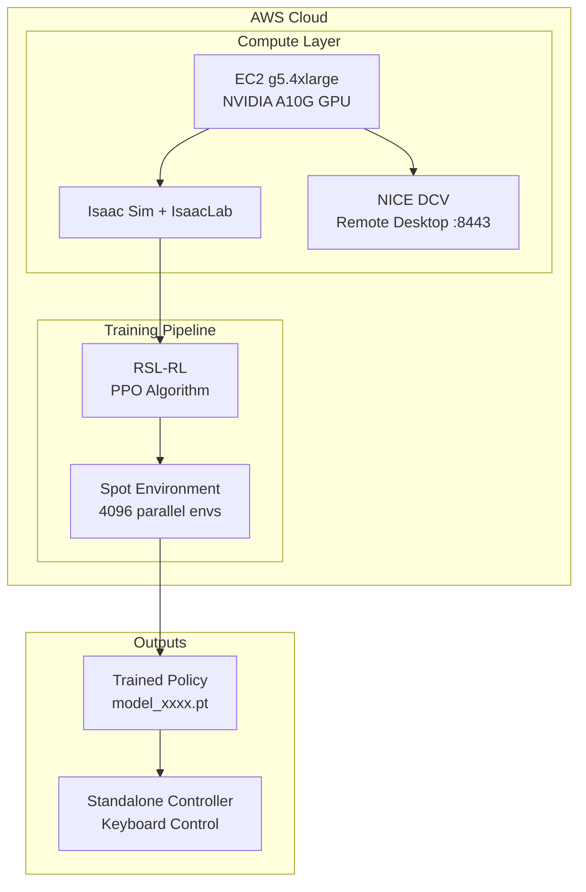
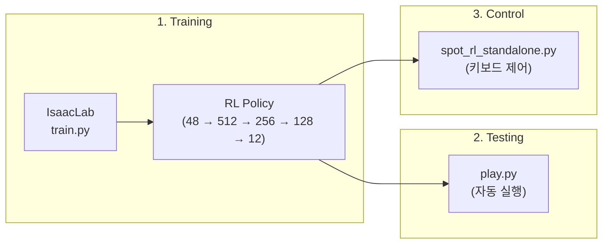

# Spot Robot RL Training & Deployment on AWS

AWS EC2에서 NVIDIA Isaac Sim/Lab을 활용한 Boston Dynamics Spot 로봇 강화학습 훈련 및 배포 가이드

## 목차

1. [EC2 인스턴스 및 Isaac Sim 설치](#1-ec2-인스턴스-및-isaac-sim-설치)
2. [Isaac Lab으로 강화학습 훈련](#2-isaac-lab으로-강화학습-훈련)
3. [Standalone 코드로 로봇 제어](#3-standalone-코드로-로봇-제어)

---

## 1. EC2 인스턴스 및 Isaac Sim 설치

### 1.1 EC2 인스턴스 생성

| 항목 | 권장 사양 |
|------|---------|
| Instance Type | g5.4xlarge (NVIDIA A10G GPU) |
| OS | Ubuntu 22.04 LTS |
| Storage | 200GB+ SSD |
| Security Group | SSH(22), DCV(8443) |

> **비용 팁**: 훈련 시 멀티 GPU 효과가 없으므로 g5.4xlarge (1x A10G)가 가성비 최적

### 1.2 설치 순서

```bash
# 1. EC2 접속
ssh -i your-key.pem ubuntu@<EC2-PUBLIC-IP>

# 2. 설치 스크립트 업로드
scp -i your-key.pem setup/*.sh ubuntu@<EC2-IP>:~/

# 3. 스크립트 실행
chmod +x *.sh

# Step 1: 시스템 패키지 및 데스크톱 환경
./01_ec2_setup.sh

# Step 2: NVIDIA 드라이버 설치
./02_nvidia_driver.sh
sudo reboot

# Step 3: (재부팅 후) Isaac Sim 설치
./03_isaac_sim_install.sh

# Step 4: NICE DCV 원격 데스크톱 설치
./04_nicedcv_setup.sh
```

### 1.3 각 설치 스크립트 설명

#### 01_ec2_setup.sh
- 시스템 패키지 업데이트
- 필수 패키지 설치 (git, python3.10, build-essential 등)
- XFCE4 데스크톱 환경 설치
- ubuntu 사용자 비밀번호 설정

#### 02_nvidia_driver.sh
- NVIDIA A10G GPU 드라이버 자동 설치
- 재부팅 필요

```bash
# 설치 확인
nvidia-smi
```

#### 03_isaac_sim_install.sh
- Isaac Sim 저장소 클론
- 환경 변수 설정

```bash
# Isaac Sim 설치 위치
~/isaac-sim/IsaacSim

# Isaac Sim 실행
cd ~/isaac-sim/IsaacSim/_build/linux-x86_64/release
./isaac-sim.sh

# Python 스크립트 실행
./python.sh ~/your_script.py
```

#### 04_nicedcv_setup.sh
- NICE DCV 서버 설치 및 구성
- 자동 세션 생성 설정 (재부팅 후 자동 시작)

```bash
# DCV 접속 정보
Address: <EC2-PUBLIC-IP>:8443
Username: ubuntu
Password: (설정한 비밀번호)

# DCV 세션 확인
dcv list-sessions
```

### 1.4 IsaacLab 설치

Isaac Lab은 Isaac Sim 위에서 동작하는 강화학습 프레임워크입니다.

```bash
# IsaacLab 클론 (HTTPS 사용)
cd ~/isaac-sim
git clone https://github.com/isaac-sim/IsaacLab.git
cd IsaacLab

# Isaac Sim과 연결 (심볼릭 링크)
ln -s ~/isaac-sim/IsaacSim/_build/linux-x86_64/release _isaac_sim

# IsaacLab 설치
./isaaclab.sh --install
```

---

## 2. Isaac Lab으로 강화학습 훈련

### 2.1 훈련 시작

```bash
cd ~/isaac-sim/IsaacLab

# Spot 로봇 속도 추적 훈련 (평평한 지형)
./isaaclab.sh -p scripts/reinforcement_learning/rsl_rl/train.py \
  --task Isaac-Velocity-Flat-Spot-v0 \
  --num_envs 4096 \
  --headless \
  --max_iterations 1500
```

### 2.2 주요 훈련 옵션

| 옵션 | 설명 | 권장값 |
|------|------|--------|
| `--task` | 훈련 태스크 | Isaac-Velocity-Flat-Spot-v0 |
| `--num_envs` | 병렬 환경 수 | 4096 (최적) |
| `--headless` | GUI 없이 실행 | 필수 (속도 향상) |
| `--max_iterations` | 훈련 반복 횟수 | 1500~3000 |
| `--video` | 훈련 비디오 녹화 | 선택 |
| `--resume` | 이전 체크포인트에서 재개 | 선택 |

### 2.3 훈련 속도 비교

| 설정 | Iteration 시간 | 예상 완료 시간 |
|------|--------------|--------------|
| GUI + 4096 envs | - | ~20시간 |
| **headless + 4096 envs** | **2.72s** | **~1.5시간** |
| headless + 8192 envs | 3.67s | ~3시간 |

> **중요**: `--headless` 옵션은 **필수**입니다. GUI 렌더링이 GPU 자원을 소모하여 훈련 속도가 크게 저하됩니다.

### 2.4 훈련 결과 저장 위치

```
~/isaac-sim/IsaacLab/logs/rsl_rl/spot_flat/
└── 2026-01-15_02-09-06/           # 날짜_시간
    ├── params/
    │   ├── env.yaml               # 환경 설정
    │   └── agent.yaml             # 에이전트 설정
    ├── model_500.pt               # 체크포인트 (500 iteration)
    ├── model_1000.pt
    ├── model_1500.pt              # 최종 모델
    └── videos/                    # --video 사용 시
```

### 2.5 훈련된 정책 테스트 (play.py)

```bash
# 훈련된 모델 실행
./isaaclab.sh -p scripts/reinforcement_learning/rsl_rl/play.py \
  --task Isaac-Velocity-Flat-Spot-v0 \
  --num_envs 32

# 특정 체크포인트 지정
./isaaclab.sh -p scripts/reinforcement_learning/rsl_rl/play.py \
  --task Isaac-Velocity-Flat-Spot-v0 \
  --checkpoint logs/rsl_rl/spot_flat/2026-01-15_02-09-06/model_1500.pt

# 비디오 녹화
./isaaclab.sh -p scripts/reinforcement_learning/rsl_rl/play.py \
  --task Isaac-Velocity-Flat-Spot-v0 \
  --video --video_length 300
```

### 2.6 play.py와 키보드 컨트롤

> **중요**: IsaacLab의 공식 `play.py`는 **키보드 컨트롤을 지원하지 않습니다**.

| 기능 | play.py | spot_rl_standalone.py |
|------|---------|----------------------|
| 정책 실행 | O | O |
| 키보드 제어 | X | O |
| 실시간 속도 명령 | X | O |
| 원본 렌더링 | X (Fabric 모드) | O |

`play.py`는 훈련된 정책을 자동으로 실행하기만 합니다. 키보드로 로봇을 직접 제어하려면 아래의 **Standalone 코드**를 사용해야 합니다.

---

## 3. Standalone 코드로 로봇 제어

### 3.1 개요

`spot_rl_standalone.py`는 훈련된 RL 정책을 키보드로 제어할 수 있는 standalone 컨트롤러입니다.

| 특징 | 설명 |
|------|------|
| 렌더링 | 원본 Isaac Sim (로봇 메쉬 표시) |
| 제어 방식 | 훈련된 RL 정책 |
| 입력 | 키보드 (WASDQE) |
| Physics | 500Hz (IsaacLab과 동일) |
| 정책 실행 | 50Hz (Decimation 10) |

### 3.2 파일 구조

```
src/
├── spot_robot_controller.py      # 수동 PD 제어 (RL 미사용)
└── spot_rl_standalone.py         # RL 정책 + 키보드 제어 (권장)
```

### 3.3 Standalone 코드 업로드 및 실행

```bash
# 서버에 업로드
scp -i your-key.pem src/spot_rl_standalone.py ubuntu@<EC2-IP>:~/spot_project/src/

# 서버에서 실행
cd ~/isaac-sim/IsaacSim/_build/linux-x86_64/release
./python.sh ~/spot_project/src/spot_rl_standalone.py
```

### 3.4 키보드 조작

| 키 | 동작 | 속도 |
|---|------|-----|
| W | 전진 (빠르게) | vx = 1.0 m/s |
| S | 정지 | vx = 0.0 m/s |
| A | 좌회전 | yaw = +0.5 rad/s |
| D | 우회전 | yaw = -0.5 rad/s |
| Q | 좌측 횡이동 | vy = +0.5 m/s |
| E | 우측 횡이동 | vy = -0.5 m/s |

> **참고**: 정책이 완전 정지 상태를 학습하지 않아, 기본적으로 느린 속도(0.5 m/s)로 전진합니다.

### 3.5 핵심 구현 사항

#### PD 게인 설정 (USD DriveAPI)
```python
from pxr import UsdPhysics

# IsaacLab 훈련과 동일한 PD 게인
KP = 60.0  # Stiffness
KD = 1.5   # Damping

for joint_name in JOINT_NAMES:
    joint_prim = stage.GetPrimAtPath(f"/World/Spot/{joint_name}")
    drive_api = UsdPhysics.DriveAPI.Get(joint_prim, "angular")
    drive_api.GetStiffnessAttr().Set(KP)
    drive_api.GetDampingAttr().Set(KD)
```

#### 관측값 구조 (48차원)
```python
obs = [
    base_lin_vel,      # 3: 로봇 기준 선형 속도
    base_ang_vel,      # 3: 로봇 기준 각속도
    projected_gravity, # 3: 로봇 기준 중력 방향
    velocity_commands, # 3: 속도 명령 (vx, vy, yaw)
    joint_pos_rel,     # 12: 기본값 대비 상대 관절 위치
    joint_vel,         # 12: 관절 속도
    last_action        # 12: 이전 액션
]
```

#### 정책 적용
```python
# 10 physics step마다 정책 실행 (Decimation)
if step % 10 == 0:
    obs = compute_observation(spot, cmd, last_action)
    action = policy(obs)
    target_pos = default_joint_pos + action * 0.2  # Action scale
    spot.apply_action(ArticulationAction(joint_positions=target_pos))
```

### 3.6 체크포인트 경로 설정

`spot_rl_standalone.py`에서 훈련된 모델 경로를 수정:

```python
CHECKPOINT_PATH = os.path.expanduser(
    "~/isaac-sim/IsaacLab/logs/rsl_rl/spot_flat/2026-01-15_02-09-06/model_1500.pt"
)
```

### 3.7 렌더링 관련 주의사항

> **중요**: `render=True`는 시뮬레이션 불안정을 유발할 수 있습니다.

```python
# 안정적인 실행 (권장)
world.step(render=False)

# GUI 업데이트는 별도로 (10Hz)
if steps % 50 == 0:
    simulation_app.update()
```

---

## Architecture



## Data Flow



## Quick Reference

### 훈련 명령어
```bash
cd ~/isaac-sim/IsaacLab
./isaaclab.sh -p scripts/reinforcement_learning/rsl_rl/train.py \
  --task Isaac-Velocity-Flat-Spot-v0 \
  --num_envs 4096 --headless --max_iterations 1500
```

### 테스트 명령어 (자동 실행)
```bash
./isaaclab.sh -p scripts/reinforcement_learning/rsl_rl/play.py \
  --task Isaac-Velocity-Flat-Spot-v0 --num_envs 32
```

### Standalone 실행 (키보드 제어)
```bash
cd ~/isaac-sim/IsaacSim/_build/linux-x86_64/release
./python.sh ~/spot_project/src/spot_rl_standalone.py
```

## Troubleshooting

### IsaacLab 설치 오류
```bash
# Python 경로 오류 시
cd ~/isaac-sim/IsaacLab
ln -s ~/isaac-sim/IsaacSim/_build/linux-x86_64/release _isaac_sim
```

### Task 이름 오류
```bash
# 잘못된 예: Flat0Spot (숫자 0)
# 올바른 예: Flat-Spot (하이픈 -)
--task Isaac-Velocity-Flat-Spot-v0
```

### DCV 세션 안됨
```bash
# 세션 수동 생성
sudo dcv create-session --type=virtual --owner ubuntu main

# 서비스 재시작
sudo systemctl restart dcvserver
```

### 로봇이 넘어짐 (Standalone)
1. PD 게인이 USD DriveAPI로 설정되었는지 확인
2. `render=False` 사용 확인
3. Decimation (10 step) 적용 확인

## References

- [NVIDIA Isaac Sim Documentation](https://docs.isaacsim.omniverse.nvidia.com/)
- [Isaac Lab GitHub](https://github.com/isaac-sim/IsaacLab)
- [RSL-RL Documentation](https://github.com/leggedrobotics/rsl_rl)
- [NICE DCV User Guide](https://docs.aws.amazon.com/dcv/)
- [Boston Dynamics Spot](https://www.bostondynamics.com/spot)

## License

MIT License
