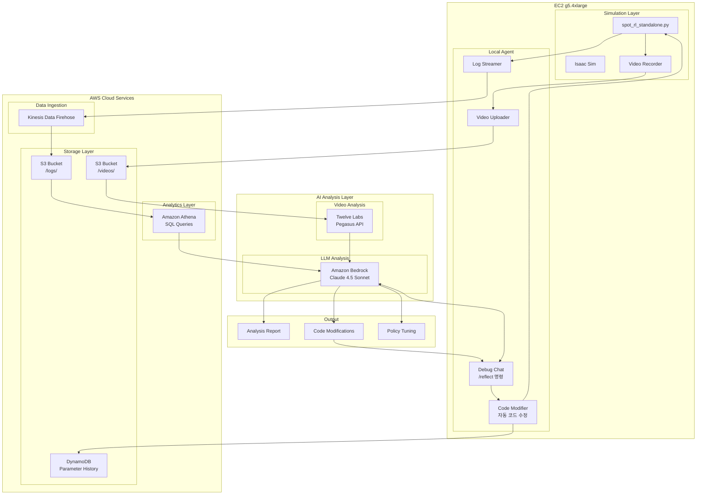
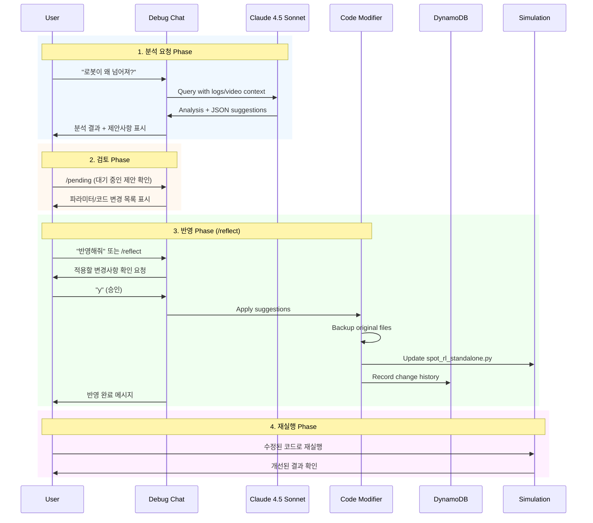

# AI-Powered Robot Debugging Architecture

## Overview

강화학습 정책 디버깅을 자동화하는 AI 분석 시스템입니다. 로봇 시뮬레이션의 로그와 비디오를 실시간으로 수집하고, AI가 분석하여 문제점을 파악하고 코드 수정을 제안합니다.

## System Architecture



## Data Flow Diagram



## Component Details

### 1. Log Data Schema

```json
{
    "timestamp": "2026-01-16T10:30:00.123Z",
    "session_id": "sess_abc123",
    "step": 1234,
    "robot_state": {
        "height": 0.496,
        "position": [1.23, 0.05, 0.496],
        "orientation": [0.999, 0.001, -0.009, -0.002],
        "linear_velocity": [0.85, 0.02, 0.01],
        "angular_velocity": [0.001, 0.002, 0.05]
    },
    "observation": {
        "base_lin_vel": [0.85, 0.02, 0.01],
        "base_ang_vel": [0.001, 0.002, 0.05],
        "projected_gravity": [0.018, -0.002, -0.999],
        "velocity_commands": [1.0, 0.0, 0.0],
        "joint_pos_rel": [0.01, -0.004, ...],
        "joint_vel": [0.1, 0.05, ...],
        "last_action": [0.5, 0.3, ...]
    },
    "action": {
        "raw": [0.52, 0.31, ...],
        "scaled": [0.104, 0.062, ...],
        "norm": 3.82
    },
    "control": {
        "cmd_vx": 1.0,
        "cmd_vy": 0.0,
        "cmd_yaw": 0.0
    },
    "status": "walking",
    "is_fallen": false
}
```

### 2. Video Analysis (Twelve Labs Pegasus)

분석 항목:
- 로봇 자세 변화 감지
- 넘어지는 순간 타임스탬프
- 보행 패턴 이상 감지
- 관절 움직임 분석

### 3. LLM Analysis Prompts

```
System: You are an expert robotics engineer specializing in
quadruped robot locomotion and reinforcement learning. Analyze
the provided simulation logs and video analysis to identify:

1. Root cause of instability
2. Specific observation/action patterns before failure
3. Recommended parameter adjustments
4. Code modifications needed

User: The robot falls at t=3.2s. Here is the log data around
that time: [log_data]. Video analysis shows: [pegasus_result].
What's causing the fall and how do I fix it?
```

### 4. Auto-Fix Suggestions

Claude가 제안하는 수정 사항:
- PD 게인 조정 (Kp, Kd)
- Action scale 조정
- Observation 계산 수정
- Decimation 조정
- 환경 파일 (env.yaml) 수정

## AWS Resources

| Resource | Purpose | Configuration |
|----------|---------|---------------|
| Kinesis Data Firehose | Log streaming | Buffer: 60s or 5MB |
| S3 Bucket | Storage | Lifecycle: 30 days |
| Athena | Log queries | Parquet format |
| Bedrock | LLM analysis | Claude 4.5 Sonnet |
| Lambda (optional) | Trigger analysis | On video upload |

## Security

- IAM roles with least privilege
- S3 bucket policy (private)
- Bedrock access via IAM
- Twelve Labs API key in Secrets Manager

## Cost Estimation (Monthly)

| Service | Estimated Cost |
|---------|---------------|
| Kinesis Firehose | ~$5 (light usage) |
| S3 Storage | ~$2 (50GB) |
| Athena Queries | ~$5 |
| Bedrock Claude | ~$20-50 (usage dependent) |
| Twelve Labs | API pricing varies |
| DynamoDB | ~$1 (on-demand) |
| **Total** | **~$35-65/month** |

## Auto-Reflect Feature (코드 자동 반영)

### Overview

`/reflect` 명령어를 통해 AI가 제안한 파라미터 변경과 코드 수정을 실제 소스코드에 자동으로 적용합니다.

### 동작 흐름

```
1. 사용자: "로봇이 왜 넘어져?"
2. Claude: 분석 후 JSON 형식으로 제안사항 반환
3. 시스템: 제안사항 자동 파싱 → pending_suggestions에 저장
4. 사용자: "반영해줘" 또는 /reflect
5. 시스템: 변경사항 표시 후 확인 요청
6. 사용자: "y" 입력
7. 시스템:
   - 원본 파일 백업 (backup/auto_reflect/)
   - 파라미터 값 업데이트
   - 코드 블록 교체
   - DynamoDB에 변경 이력 기록
8. 사용자: 수정된 코드로 시뮬레이션 재실행
```

### Claude 응답 형식

Claude는 분석 시 다음 JSON 형식으로 제안사항을 포함합니다:

```json
{
  "suggestions": {
    "parameters": [
      {
        "name": "ACTION_SCALE",
        "old_value": "0.2",
        "new_value": "0.15",
        "reason": "진동 감소를 위해 액션 스케일 축소",
        "confidence": "high"
      },
      {
        "name": "KD",
        "old_value": "1.5",
        "new_value": "2.0",
        "reason": "댐핑 증가로 오버슈트 감소",
        "confidence": "medium"
      }
    ],
    "code_blocks": [
      {
        "description": "Observation clipping 추가",
        "file": "spot_rl_standalone.py",
        "original": "obs = self.compute_observation()",
        "modified": "obs = np.clip(self.compute_observation(), -5.0, 5.0)",
        "reason": "극단적인 관측값 방지"
      }
    ],
    "summary": "액션 스케일 감소 및 댐핑 증가로 안정성 개선"
  }
}
```

### 지원 명령어

| 명령어 | 한국어 | 설명 |
|--------|--------|------|
| `/reflect` | 반영해줘, 적용해줘 | 대기 중인 제안사항 적용 |
| `/pending` | - | 대기 중인 제안사항 확인 |
| `/history` | - | 변경 이력 조회 |

### 수정 가능한 파라미터

| 파라미터 | 기본값 | 설명 |
|----------|--------|------|
| `ACTION_SCALE` | 0.2 | 액션 스케일링 계수 |
| `KP` | 60.0 | PD 제어 비례 게인 |
| `KD` | 1.5 | PD 제어 미분 게인 |
| `DECIMATION` | 10 | 제어 데시메이션 |
| `CMD_VX_SCALE` | 1.0 | 전진 명령 스케일 |
| `CMD_VY_SCALE` | 0.5 | 횡이동 명령 스케일 |
| `CMD_YAW_SCALE` | 0.5 | 회전 명령 스케일 |

### 안전 기능

1. **자동 백업**: 모든 변경 전 원본 파일 백업
   - 위치: `backup/auto_reflect/`
   - 형식: `파일명.YYYYMMDD_HHMMSS.bak`

2. **확인 프롬프트**: 변경 적용 전 사용자 확인 필수

3. **변경 이력**: DynamoDB에 모든 변경 기록
   - 파라미터명, 이전/새 값, 사유
   - AI 제안 여부 표시
   - 90일 TTL 자동 만료

4. **롤백 가능**: 백업 파일로 언제든지 복원 가능

### 사용 예시

```
You: 로봇이 3초 후에 넘어지는데 어떻게 수정해야 해?

Claude: 로그를 분석한 결과...
[AI] 2개 파라미터, 0개 코드블록 제안 감지됨
     '/reflect' 또는 '반영해줘'로 적용 가능

You: 반영해줘

============================================================
📋 적용할 제안 사항:
============================================================
파라미터 변경 (2개):
  1. ACTION_SCALE: 0.2 -> 0.15
     이유: Reduce oscillation during walking
  2. KD: 1.5 -> 2.0
     이유: Increase damping to reduce overshoot
============================================================

위 변경사항을 적용하시겠습니까? (y/n): y

🔧 변경사항 적용 중...
[Backup] Created: backup/auto_reflect/spot_rl_standalone.py.20260116_143022.bak
[Applied] ACTION_SCALE: 0.2 -> 0.15
[DynamoDB] Recorded: ACTION_SCALE 0.2 -> 0.15
[Applied] KD: 1.5 -> 2.0
[DynamoDB] Recorded: KD 1.5 -> 2.0

✅ 반영 완료!
   총 2개 변경 적용됨
   ...
```
