# Spot Robot Simulation with AI-Powered Movement Optimization

AWS 클라우드 환경에서 NVIDIA Isaac Sim을 활용한 Boston Dynamics Spot 로봇 시뮬레이션 및 AI 기반 움직임 최적화 시스템

## Architecture

```mermaid
flowchart TB
    subgraph AWS["☁️ AWS Cloud"]
        subgraph Compute["Compute Layer"]
            EC2["🖥️ EC2 g5.4xlarge<br/>NVIDIA A10G GPU"]
            Isaac["🤖 Isaac Sim + Spot Robot"]
            DCV["🖼️ NICE DCV<br/>Remote Desktop :8443"]
        end

        subgraph Storage["Storage & Streaming"]
            S3["📦 Amazon S3<br/>Video + Logs"]
            Firehose["🔥 Kinesis Data Firehose<br/>Real-time Streaming"]
        end

        subgraph Analytics["Analytics & AI"]
            Athena["📊 Amazon Athena<br/>SQL Log Analysis"]
            Bedrock["🧠 Amazon Bedrock<br/>Claude 4.5 Sonnet<br/>(CRIS API)"]
        end
    end

    subgraph VideoAI["🎬 Video Understanding"]
        Pegasus["🎯 Twelve Labs Pegasus<br/>Video AI Analysis"]
    end

    subgraph Output["📤 Output"]
        Params["⚙️ Optimized Gait Parameters"]
    end

    EC2 --> Isaac
    EC2 --> DCV
    Isaac -->|"Video + Logs"| S3
    S3 --> Firehose
    Firehose --> Athena
    S3 -->|"Video"| Pegasus
    Pegasus -->|"Video Analysis"| Bedrock
    Athena -->|"Movement Logs"| Bedrock
    Bedrock -->|"Pattern Analysis"| Params
    Params -->|"Feedback Loop"| Isaac
```



## Data Flow


## Feedback Loop

```mermaid
flowchart LR
    A["1️⃣ Simulation<br/>Video + Logs"] --> B["2️⃣ Pegasus<br/>Analysis"]
    B --> C["3️⃣ LLM<br/>Processing"]
    C --> D["4️⃣ Pattern<br/>Detection"]
    D --> E["5️⃣ Movement<br/>Improvement"]
    E --> F["6️⃣ Parameter<br/>Optimization"]
    F --> A
```



## Project Structure

```
48.robot_nvidia/
├── README.md                    # This file
├── setup/                       # Installation scripts
│   ├── 01_ec2_setup.sh         # EC2 instance setup
│   ├── 02_nvidia_driver.sh     # NVIDIA driver installation
│   ├── 03_isaac_sim_install.sh # Isaac Sim installation
│   └── 04_nicedcv_setup.sh     # NICE DCV configuration
├── src/                         # Source code
│   └── spot_robot_controller.py # Main robot control script
└── docs/                        # Additional documentation
    └── ...
```

## Quick Start

### 1. EC2 Instance Setup

```bash
# Instance Type: g5.4xlarge (NVIDIA A10G GPU)
# OS: Ubuntu 22.04 LTS
# Security Group: SSH(22), DCV(8443)

# SSH Connection
ssh -i your-key.pem ubuntu@<EC2-PUBLIC-IP>
```

### 2. Environment Setup

```bash
# Upload and run setup scripts
scp -i your-key.pem setup/*.sh ubuntu@<EC2-IP>:~/
ssh -i your-key.pem ubuntu@<EC2-IP>

chmod +x *.sh
./01_ec2_setup.sh
./02_nvidia_driver.sh
sudo reboot

# After reboot
./03_isaac_sim_install.sh
./04_nicedcv_setup.sh
```

### 3. NICE DCV Connection

```bash
# Server-side: Create DCV session
sudo dcv create-session --type=virtual --owner ubuntu ubuntu-session

# Client-side: Connect via NICE DCV Viewer
# Address: <EC2-IP>:8443
# Username: ubuntu
# Password: <your-password>
```

### 4. Upload Source Code

```bash
# Create project directory on server
ssh -i your-key.pem ubuntu@<EC2-IP> "mkdir -p ~/spot_project/src"

# Upload source code
scp -i your-key.pem src/spot_robot_controller.py ubuntu@<EC2-IP>:~/spot_project/src/
```

### 5. Run Spot Robot Simulation

```bash
cd ~/isaac-sim/IsaacSim/_build/linux-x86_64/release
./python.sh ~/spot_project/src/spot_robot_controller.py
```

## Core Components

### Spot Robot Control Architecture

```mermaid
flowchart LR
    subgraph Input["⌨️ Input"]
        KB["Keyboard<br/>WASD"]
    end

    subgraph Controller["🎮 Controller"]
        Gait["Gait<br/>Generator"]
        Trot["Trotting<br/>Pattern"]
    end

    subgraph Robot["🤖 Robot"]
        Action["Articulation<br/>Action"]
        Joints["12 DOF<br/>Joint Control"]
    end

    KB --> Gait
    Gait --> Trot
    Trot --> Action
    Action --> Joints
```



### Joint Configuration (12 DOF)


### Trotting Gait Pattern

```mermaid
flowchart LR
    subgraph Phase0["Phase 0"]
        FL0["FL ⬆️"]
        HR0["HR ⬆️"]
    end

    subgraph PhasePI["Phase π"]
        FR1["FR ⬆️"]
        HL1["HL ⬆️"]
    end

    Phase0 -->|"Diagonal Sync"| PhasePI
    PhasePI -->|"Cycle"| Phase0
```



**Diagonal leg pairs move together:**
- **Phase 0:** FL + HR (Front-Left, Hind-Right)
- **Phase π:** FR + HL (Front-Right, Hind-Left)

```python
def compute_walking_pose(phase, cmd_x, cmd_yaw):
    """
    Trotting gait computation
    - phase: 0 ~ 2π
    - cmd_x: forward/backward (-1 to 1)
    - cmd_yaw: rotation (-1 to 1)
    """
    target = standing_pose.copy()

    for leg in ['FL', 'FR', 'HL', 'HR']:
        # Diagonal synchronization
        if leg in ['FL', 'HR']:
            leg_phase = phase
        else:  # FR, HL
            leg_phase = (phase + np.pi) % (2 * np.pi)

        # Swing phase: leg in air, moving forward
        # Stance phase: leg on ground, pushing backward
        is_swing = leg_phase > np.pi
        ...

    return target
```

## Key Parameters

| Parameter | Value | Description |
|-----------|-------|-------------|
| Physics DT | 1/120 sec | Physics simulation timestep |
| Rendering DT | 1/60 sec | Rendering timestep |
| Gait Speed | 0.15 | Walking phase increment |
| Step Height | 0.3 rad | Knee lift during swing |
| Step Length | 0.4 rad | Hip movement range |

## USD Default Pose (Stable Standing)

```python
# Values from Isaac Sim Spot USD file
standing_pose = {
    'hip_x': [0.1, -0.1, 0.1, -0.1],    # FL, FR, HL, HR
    'hip_y': [0.9, 0.9, 1.1, 1.1],      # Front legs: 0.9, Hind legs: 1.1
    'knee':  [-1.5, -1.5, -1.5, -1.5]   # All legs
}
```

## AWS Services Integration

```mermaid
flowchart TB
    subgraph Services["AWS Services"]
        S3["📦 Amazon S3<br/>• Video storage<br/>• Movement logs"]
        Firehose["🔥 Kinesis Firehose<br/>• Real-time streaming<br/>• Auto S3 delivery"]
        Athena["📊 Amazon Athena<br/>• SQL queries<br/>• Pattern analysis"]
        Bedrock["🧠 Amazon Bedrock<br/>• Claude 4.5 Sonnet<br/>• CRIS API endpoint<br/>• Gait optimization"]
    end

    subgraph External["External Services"]
        Pegasus["🎯 Twelve Labs Pegasus<br/>• Video understanding<br/>• Visual analysis<br/>• Anomaly detection"]
    end

    S3 --> Firehose
    Firehose --> Athena
    S3 --> Pegasus
    Pegasus --> Bedrock
    Athena --> Bedrock
```



## Keyboard Controls

| Key | Action |
|-----|--------|
| W | Forward |
| S | Backward |
| A | Turn Left |
| D | Turn Right |
| Space | Stop |

## Troubleshooting

### Robot Falls at Startup
- Use USD default pose instead of custom values
- Start at appropriate height (0.7m)
- Apply gradual stabilization phase

### No Movement Response
- Increase gait parameters (step_height, step_length)
- Check keyboard focus on 3D viewport

### DCV Connection Issues
- Remove `web-url-path` from `/etc/dcv/dcv.conf`
- Ensure `~/.xsession` exists with XFCE4 startup

## References

- [NVIDIA Isaac Sim Documentation](https://docs.isaacsim.omniverse.nvidia.com/)
- [Boston Dynamics Spot](https://www.bostondynamics.com/spot)
- [NICE DCV User Guide](https://docs.aws.amazon.com/dcv/)
- [Twelve Labs Pegasus](https://twelvelabs.io/)
- [Amazon Bedrock](https://aws.amazon.com/bedrock/)

## License

MIT License

## Author

Spot Robot Simulation Project Team
